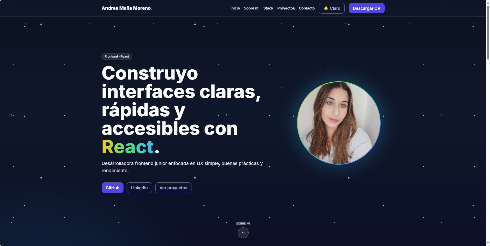
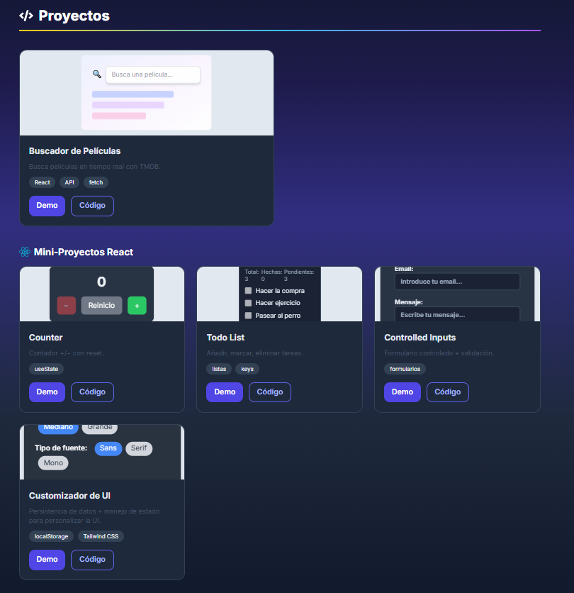
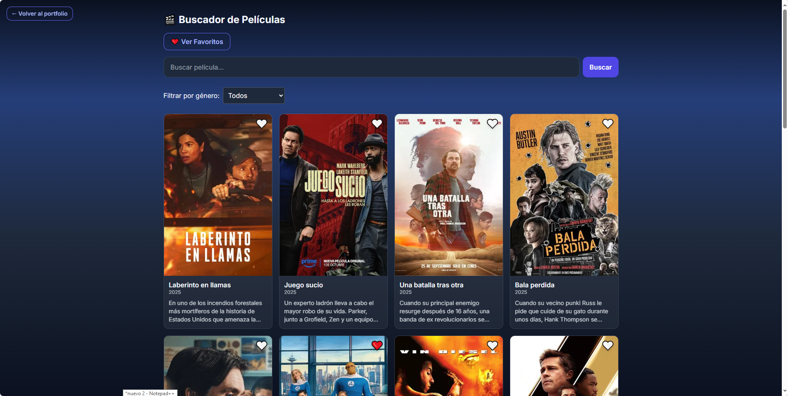

# 🎬 Portfolio — Mini Apps + Buscador de Películas

Este repositorio contiene mi **portfolio en React** donde muestro mini-proyectos prácticos y un proyecto principal destacado: un **Buscador de Películas** usando la API de [The Movie Database (TMDB)](https://www.themoviedb.org/).

> 🔦 **Modo oscuro por defecto**. Incluye toggle Claro/Oscuro y diseño **responsive**.

---

## 🚀 Tecnologías

- ⚛️ **React** (Vite)
- 🎨 **Tailwind CSS**
- 🧭 **React Router**
- 🧩 **Framer Motion** (animaciones suaves)
- 🗂️ **Git + GitHub**
- 🌐 **TMDB API** (para el buscador)

---

## 🗂️ Estructura del proyecto

```
src/
├─ components/
│  ├─ Header.jsx
│  ├─ Footer.jsx
│  ├─ sections/
│  │  ├─ Hero.jsx
│  │  ├─ About.jsx
│  │  ├─ Stack.jsx
│  │  └─ Projects/
│  │     ├─ Projects.jsx
│  │     ├─ ProjectsCard.jsx
│  │     ├─ Modal.jsx
│  │     └─ TodoPreview.jsx
│  └─ Contact.jsx
│
├─ MiniApps/
│  ├─ Counter/
│  ├─ Todo/
│  ├─ Controlled/
│  ├─ CustomUI/
│  └─ BuscadorPeliculas/
│     ├─ Api.js
│     ├─ components/
│     └─ pages/
│        ├─ MoviesPage.jsx
│        ├─ MovieDetailPage.jsx
│        └─ FavoritesPage.jsx
│
├─ assets/
├─ App.jsx
├─ main.jsx
└─ index.css
```

---

## 🧪 Mini-proyectos

- ➕ **Counter** — contador con incrementar/decrementar y reset.
- ✅ **Todo List** — añadir, marcar y eliminar tareas.
- 📝 **Controlled Inputs** — formulario controlado con validación básica.
- 🎛️ **Customizador de UI** — personaliza tema/fuentes con `localStorage`.

---

## 🎥 Proyecto principal: Buscador de Películas (TMDB)

**Características**
- 🔍 Búsqueda en tiempo real  
- 🖼️ Resultados con título y póster  
- 📄 Detalle de película con sinopsis  
- ⭐ Favoritos persistidos en `localStorage`  
- 🧭 Navegación con React Router

**Rutas**
- `/peliculas` — listado / buscador  
- `/peliculas/:id` — detalle  
- `/favoritos` — favoritos guardados  

> ℹ️ TMDB requiere API key (ver *Configuración*).

---

## ⚙️ Configuración

### Clonar e instalar
git clone https://github.com/Andraxmm/Portfolio.git
cd Portfolio
npm install


---

## 🖼️ Preview





---

**Variables de entorno (TMDB)**
- VITE_TMDB_API_KEY=TU_API_KEY_DE_TMDB


**Ejecutar en desarrollo**
- npm run dev

**Build de producción**
- npm run build
- npm run preview

--- 

🌓 Tema y accesibilidad
Dark mode por defecto (con toggle a claro).

Desplazamiento suave y compensación de anclas para header fijo.

UI responsive (móvil, tablet y desktop).

Feedback táctil en botones/tarjetas en dispositivos móviles.

---

🔗 Enlaces
Portfolio (repo): https://github.com/Andraxmm/Portfolio

GitHub: https://github.com/Andraxmm

LinkedIn: https://www.linkedin.com/in/andrea-ma%C3%B1a-moreno-204a2a1b5/

Cuando despliegues (Vercel/Netlify), añade aquí el link de demo.

---

🙌 Créditos
Datos e imágenes de películas por TMDB.
Este producto usa la API de TMDB pero no está avalado ni certificado por TMDB.
